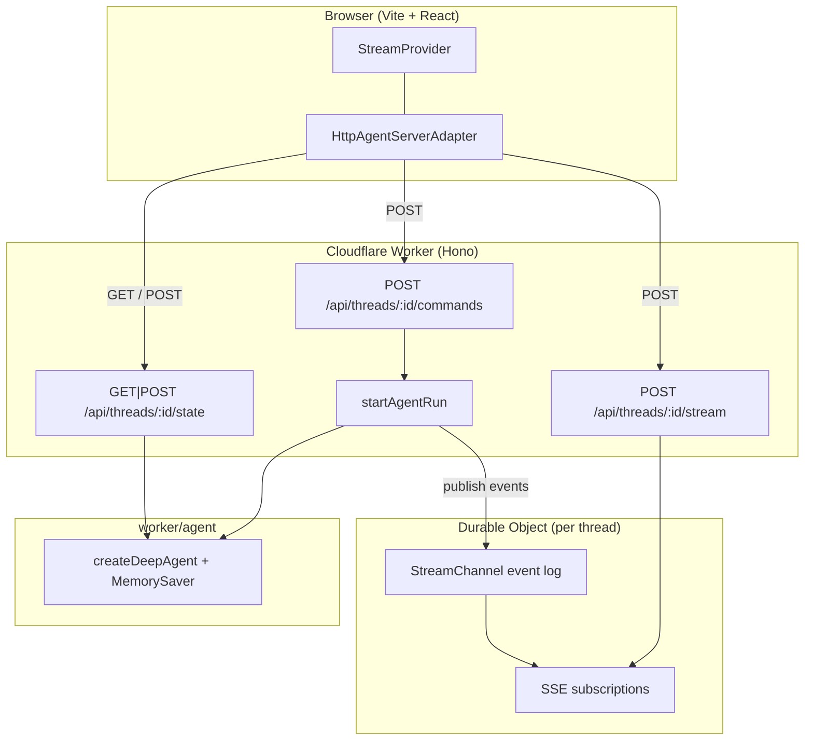

# Deploying a LangChain Agent with Cloudflare Workers

An example app that deploys a LangChain **deep agent** on
[Cloudflare Workers](https://developers.cloudflare.com/workers/) — streaming chat
UI, subagents, and thread history, all backed by the
[Agent Streaming Protocol](https://github.com/langchain-ai/agent-protocol/tree/main/streaming) implemented as Worker
routes (HTTP + SSE). The React SPA is served from the same Worker via
[Workers Assets](https://developers.cloudflare.com/workers/static-assets/). No
separate backend process — one Worker serves the SPA and the protocol API.

## Deploy to Cloudflare

1. Install dependencies and build:

   ```bash
   cd js-cloudflare
   cp .env.example .dev.vars   # set OPENAI_API_KEY for local dev
   pnpm install
   pnpm build
   ```

2. Log in and set your secret:

   ```bash
   npx wrangler login
   npx wrangler secret put OPENAI_API_KEY
   ```

3. Deploy:

   ```bash
   pnpm run deploy
   ```

Wrangler uploads the Vite build (SPA) and the Worker script in one deploy.
`nodejs_compat` and `nodejs_compat_populate_process_env` are enabled so LangChain
can read `OPENAI_API_KEY` from the environment.

`wrangler.jsonc` registers the `ThreadSession` Durable Object with
`new_sqlite_classes`, which is required on the Workers **Free** plan (error
`10097` if you use the legacy `new_classes` migration instead).

Optionally enable LangSmith tracing by adding the variables from
[`.env.example`](./.env.example) as Worker secrets or vars.

## Required API endpoints

The app exposes the Agent Streaming Protocol under `/api/threads/...`. Routes
are implemented in `worker/index.ts` with [Hono](https://hono.dev).

### Minimum (streaming chat)

| Method         | Path                              | Purpose                                                        |
| -------------- | --------------------------------- | -------------------------------------------------------------- |
| `POST`         | `/api/threads/:threadId/commands` | Accept protocol commands (`run.start`, …) and start agent runs |
| `POST`         | `/api/threads/:threadId/stream`   | SSE stream of protocol events for a run                        |
| `GET` / `POST` | `/api/threads/:threadId/state`    | Read and bootstrap checkpointed thread state                   |

### Optional (sidebar)

| Method   | Path                             | Purpose                                   |
| -------- | -------------------------------- | ----------------------------------------- |
| `GET`    | `/api/threads`                   | List threads known to the checkpointer    |
| `DELETE` | `/api/threads/:threadId`         | Delete a thread's session and checkpoints |
| `POST`   | `/api/threads/:threadId/history` | Paginated checkpoint history              |

### Request flow



1. Bootstrap thread state (`GET`/`POST /state`).
2. On submit, the SDK sends `run.start` to `/commands` and receives a `run_id`.
3. The Worker starts the graph run and fans each protocol event into the
   thread's **Durable Object**.
4. The SDK subscribes to `/stream` (SSE). The DO replays buffered events and
   stays attached for live frames — even across Worker isolate restarts.
5. Subagent (`task`) runs emit namespaced events surfaced as `stream.subagents`.

## Cloudflare backend design

| Concern       | Implementation                                          |
| ------------- | ------------------------------------------------------- |
| Frontend      | Vite + React SPA (`src/`)                               |
| API layer     | Hono routes in `worker/index.ts`                        |
| Runtime       | Workers V8 + `nodejs_compat`                            |
| SSE replay    | Per-thread **Durable Object** (`ThreadSession`)         |
| Agent runs    | Worker isolate; protocol events POSTed to the DO        |
| Static assets | Workers Assets (`wrangler.jsonc` → `assets`)            |
| Secrets       | `wrangler secret` / `.dev.vars`                         |
| Local dev     | `vite` (Cloudflare Vite plugin runs the Worker runtime) |

The split between **Worker** (agent + checkpointer) and **Durable Object** (SSE
event log) is the main design choice on Cloudflare. Worker isolates are
ephemeral, so replay buffers live in Durable Objects rather than process memory.

## Production persistence

Out of the box, the agent uses an in-memory `MemorySaver` checkpointer
(`worker/agent/index.ts`). That works for local dev and demos, but on Cloudflare
(multiple isolates, cold starts) conversation state is **not durable** across
deploys or isolates.

For production:

1. Swap in a [durable checkpointer](https://docs.langchain.com/oss/javascript/langgraph/checkpointers#checkpointer-libraries)
   (for example Postgres via Hyperdrive, or a custom DO-backed store).
2. Keep per-thread Durable Objects for SSE replay (or persist the event log to
   DO storage / KV for long-lived reconnects).

See also: [checkpointer libraries](https://docs.langchain.com/oss/javascript/langgraph/checkpointers#checkpointer-libraries),
[add memory / persistence](https://docs.langchain.com/oss/javascript/langgraph/add-memory).

## Local development

```bash
cp .env.example .dev.vars   # set OPENAI_API_KEY
pnpm install
pnpm dev
```

Open [http://localhost:5173](http://localhost:5173). The Cloudflare Vite plugin
runs your Worker in the Workers runtime during dev, so `/api/*` routes behave
like production.

```bash
pnpm build    # production build (client + worker)
pnpm preview  # preview the production build locally
pnpm typecheck
```

## Project layout

- `src/components/` — chat UI (`ChatApp`, `Chat`, `MessageThread`, `Subagents`,
  `ThreadHistory`, …).
- `src/lib/chat/threads-client.ts` — browser thread bootstrap and sidebar helpers.
- `worker/agent/` — deep agent (`createDeepAgent`) with `researcher` and
  `math-whiz` subagents and mock tools.
- `worker/server/` — protocol helpers: `runs.ts` (start runs on the Worker),
  `threads.ts` (checkpointer-backed state), `serialize.ts`, `registry.ts`.
- `worker/durable-objects/thread-session.ts` — per-thread SSE event log
  (`StreamChannel` + `matchesSubscription`).
- `worker/index.ts` — Hono app: protocol routes + Worker export.
- `wrangler.jsonc` — Worker config: `nodejs_compat`, Durable Object bindings,
  SPA asset routing (`run_worker_first: ["/api/*"]`).

## References

- [Agent Streaming Protocol](https://github.com/langchain-ai/agent-protocol/tree/main/streaming) — protocol spec consumed by `@langchain/react`'s `HttpAgentServerAdapter`
- [`react-custom-backend`](https://github.com/langchain-ai/streaming-cookbook) — original Vite + Hono reference for a custom protocol server
- [Cloudflare Workers](https://developers.cloudflare.com/workers/) — edge runtime and deployment
- [Durable Objects](https://developers.cloudflare.com/durable-objects/) — per-thread SSE replay storage
- [Workers Assets](https://developers.cloudflare.com/workers/static-assets/) — SPA hosting from the same Worker
- [`deepagents`](https://www.npmjs.com/package/deepagents) — coordinator + subagent orchestration used by this demo
