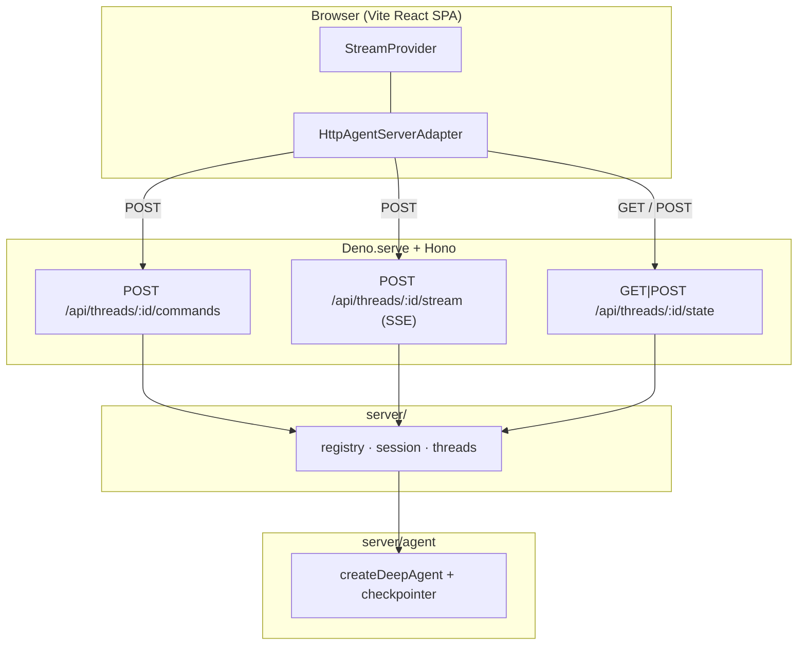

# Deploying a LangChain Agent with Deno Deploy

An example app that deploys a LangChain **deep agent** on [Deno Deploy](https://deno.com/deploy) — streaming chat UI, subagents, and thread history, all backed by the [Agent Streaming Protocol](https://github.com/langchain-ai/agent-protocol/tree/main/streaming) implemented as HTTP + SSE route handlers on a Hono server. The React frontend is a Vite SPA (ported 1:1 from [`js-next`](../js-next)); Deno serves the built static assets and the API from a single `main.ts` entrypoint.

It is a port of the Next.js [`js-next`](../js-next) example into Deno + Hono, showing how to run the same agent stack on Deno Deploy instead of Vercel.

## Deploy to Deno Deploy

1. Fork or clone [`langchain-ai/deployment-cookbook`](https://github.com/langchain-ai/deployment-cookbook).
2. In the [Deno Deploy dashboard](https://dash.deno.com/), create a new project linked to this repo.
3. Set **Root Directory** to `js-deno`.
4. Set the **build command** to `deno task build:client` (builds the Vite SPA into `dist/`).
5. Set the **entrypoint** to `main.ts`.
6. Add `OPENAI_API_KEY` in project environment variables.
7. Deploy.

Alternatively, use the Deno Deploy CLI after building the client locally:

```bash
cd js-deno
deno task build:client
deployctl deploy --project=your-project main.ts
```

Optionally enable LangSmith tracing by adding the variables from [`.env.example`](./.env.example).

## Required API endpoints

The app exposes the Agent Streaming Protocol under `/api/threads/...`. Route handlers live in `server/routes.ts` and mirror the Next.js handlers in `js-next/app/api/threads/`.

### Minimum (streaming chat)

| Method         | Path                              | Purpose                                                        |
| -------------- | --------------------------------- | -------------------------------------------------------------- |
| `POST`         | `/api/threads/:threadId/commands` | Accept protocol commands (`run.start`, …) and start agent runs |
| `POST`         | `/api/threads/:threadId/stream`   | SSE stream of protocol events for a run                        |
| `GET` / `POST` | `/api/threads/:threadId/state`    | Read and bootstrap checkpointed thread state                   |

### Optional (this app's sidebar)

| Method   | Path                             | Purpose                                       |
| -------- | -------------------------------- | --------------------------------------------- |
| `GET`    | `/api/threads`                   | List threads known to the checkpointer        |
| `DELETE` | `/api/threads/:threadId`         | Delete a thread's session and checkpoints     |
| `POST`   | `/api/threads/:threadId/history` | Paginated checkpoint history (Agent Protocol) |

### Request flow



1. Bootstrap thread state (`GET`/`POST /state`).
2. On submit, the SDK sends `run.start` to `/commands` and receives a `run_id`.
3. The SDK subscribes to `/stream` (SSE) for replay + live protocol events.
4. Subagent (`task`) runs emit namespaced events surfaced as `stream.subagents`.

## How the Deno backend works

This example runs as a **single Deno process**:

- **`main.ts`** — `Deno.serve` + Hono app. Mounts `/api` routes and serves the Vite-built SPA from `dist/`.
- **`server/routes.ts`** — Hono route definitions for the Agent Streaming Protocol (equivalent to `js-next/app/api/threads/`).
- **`server/session.ts`** — `LocalThreadSession`: buffers protocol events in a LangGraph `StreamChannel`, filters with `matchesSubscription`, and fans matching frames out over SSE `ReadableStream`.
- **`server/threads.ts`** — checkpointer-backed `getState` / `updateState` / `getHistory` helpers in the LangGraph SDK wire format.
- **`server/registry.ts`** — process-local singleton owning the agent and one session per thread id.
- **`server/agent/`** — same `createDeepAgent` orchestrator as `js-next` (researcher + math-whiz subagents, mock tools).

Deno Deploy runs each isolate with its own in-memory `MemorySaver` checkpointer. For production persistence across isolates, swap in a [durable checkpointer](https://docs.langchain.com/oss/javascript/langgraph/checkpointers#checkpointer-libraries) (Postgres, Redis, …) — the route handlers and `server/threads.ts` helpers stay the same.

## Production persistence

Out of the box, the agent uses an in-memory `MemorySaver` checkpointer (`server/agent/index.ts`) and a process-local session map (`server/registry.ts`). That works for local dev and single-isolate deployments, but on Deno Deploy (multiple isolates, cold starts) conversation state is **not durable** across instances.

Replace `MemorySaver` in `server/agent/index.ts` with a durable checkpointer such as `@langchain/langgraph-checkpoint-postgres` or `@langchain/langgraph-checkpoint-redis`. You will also want a shared session/replay store so SSE reconnection works across isolates.

## Local development

You need [Deno](https://deno.com/) 2.x and [pnpm](https://pnpm.io/) for the client.

```bash
cp .env.example .env   # set OPENAI_API_KEY
export $(grep -v '^#' .env | xargs)   # load env for Deno

# Terminal 1 — API + static (after first client build)
deno task build:client   # first time only
deno task dev

# Terminal 2 — Vite dev server with HMR (proxies /api to :8000)
cd client && pnpm install && pnpm dev
```

Open [http://localhost:5173](http://localhost:5173) for development with hot reload. The Vite dev server proxies `/api` to the Deno server on port 8000.

For a production-like local run (single server, no HMR):

```bash
deno task build:client
deno task start
```

Open [http://localhost:8000](http://localhost:8000).

## Project layout

- `main.ts` — Deno Deploy entrypoint (`Deno.serve` + Hono).
- `server/agent/` — deep agent (`createDeepAgent`) with subagents and mock tools.
- `server/` — protocol server logic: `session.ts`, `threads.ts`, `serialize.ts`, `registry.ts`, `routes.ts`.
- `client/` — Vite + React SPA (same UI as `js-next/components/`).
- `dist/` — Vite build output served by Deno (generated by `deno task build:client`).
