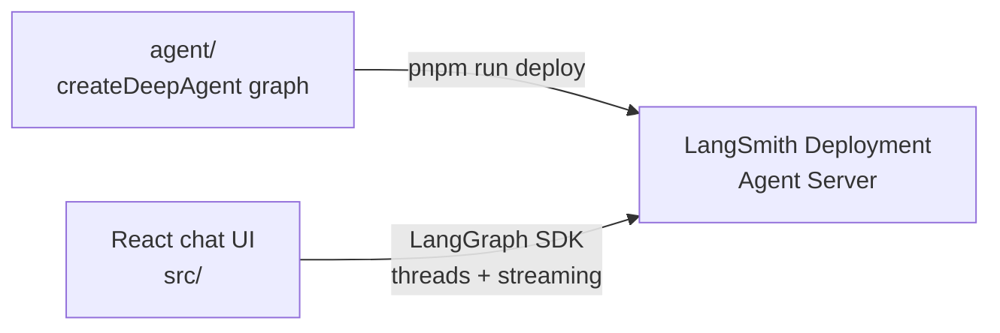

# Deploying a LangChain Agent with LangSmith + Vite

This example gets you from a local checkout to a deployed LangChain deep agent with a working chat UI. The backend runs as a [LangSmith Deployment](https://docs.langchain.com/langsmith/deployment), and the frontend is a Vite + React app that streams from it.

Use this page when you want to run the agent locally, deploy it to LangSmith, and point the UI at the deployed Agent Server.

## Start Here

### What you are deploying

A **LangSmith Deployment** runs a LangGraph graph on LangSmith's hosted Agent Server. In this example:

- `agent/` contains the deep agent graph, subagents, middleware, and tools.
- `langgraph.json` tells the LangGraph CLI which graph to serve and deploy.
- `src/` contains the React chat UI.
- The UI talks to the Agent Server API through the LangGraph SDK and `@langchain/react`.

The deployed agent is a coordinator with two subagents:

- `researcher` uses the local `search_web` tool.
- `math-whiz` uses the local `calculator` tool.

### How the pieces fit



During local development, `pnpm run dev` starts both the LangGraph dev server and the Vite app. In production, LangSmith hosts the agent and Vercel hosts the static UI.

### What you need

- A [LangSmith API key](https://docs.langchain.com/langsmith/create-account-api-key) with deployment access.
- An OpenAI API key for the agent model.
- `pnpm`.

## Run Locally

### 1. Install dependencies

```bash
cd js-langsmith
pnpm install
```

### 2. Create your local environment file

```bash
cp .env.example .env
```

Open `.env` and set:

```bash
OPENAI_API_KEY=<your OpenAI API key>
```

Leave `LANGSMITH_API_KEY` and `VITE_AGENT_API_URL` empty for local development. You only need `LANGSMITH_API_KEY` when deploying or testing the UI against a remote LangSmith deployment.

### 3. Start the agent and UI with one command

```bash
pnpm run dev
```

This starts both processes:

- LangGraph dev server at [http://localhost:2024](http://localhost:2024).
- Vite dev server at [http://localhost:5173](http://localhost:5173).

### 4. Open the chat

Open [http://localhost:5173](http://localhost:5173). Try a prompt that uses both subagents:

```text
Research LangGraph streaming, and separately calculate 42 * 17.
```

When `VITE_AGENT_API_URL` is empty, the Vite app uses its local proxy at `/api/langgraph`, which forwards requests to the LangGraph dev server and avoids CORS issues.

## Deploy In 5 Steps

### 1. Confirm your environment

Your `.env` must include:

```bash
OPENAI_API_KEY=<your OpenAI API key>
LANGSMITH_API_KEY=<your LangSmith API key>
```

Optionally set a deployment name:

```bash
LANGSMITH_DEPLOYMENT_NAME=deployment-cookbook-agent
```

If `LANGSMITH_DEPLOYMENT_NAME` is unset, the deployment name defaults to the directory name.

### 2. Deploy the agent to LangSmith

```bash
pnpm run deploy
```

This runs:

```bash
langgraphjs deploy
```

The CLI uses `langgraph.json` to deploy the `agent` graph from `agent/index.ts`.

### 3. Copy the deployment API URL

After deploy, open the deployment in LangSmith and copy its **API URL**. It should look like:

```text
https://your-app.us.langgraph.app/
```

Use the root URL only. Do not add any API path suffix.

### 4. Test the UI against the remote deployment

Set `VITE_AGENT_API_URL` in `.env`:

```bash
VITE_AGENT_API_URL=https://your-app.us.langgraph.app
```

Then run the UI:

```bash
pnpm run dev
```

The browser client reuses `LANGSMITH_API_KEY` when talking to the remote deployment.

> [!WARNING]
> The demo exposes `LANGSMITH_API_KEY` to the browser bundle so the UI can call the LangSmith deployment directly. That is convenient for local testing, but not production-safe. For a real app, proxy requests through your own backend and keep the key server-side.

### 5. Deploy the frontend to Vercel

[](https://vercel.com/new/clone?repository-url=https%3A%2F%2Fgithub.com%2Flangchain-ai%2Fdeployment-cookbook&root-directory=js-langsmith&env=VITE_AGENT_API_URL,LANGSMITH_API_KEY&envDescription=LangSmith%20deployment%20URL%20and%20API%20key)

In Vercel:

1. Create a project from this repo.
2. Set **Root Directory** to `js-langsmith`.
3. Use the default Vite build. The build output is `dist/`.
4. Set these environment variables:
   - `VITE_AGENT_API_URL`: the LangSmith deployment root URL.
   - `LANGSMITH_API_KEY`: the LangSmith API key used by the demo client.

The agent is deployed separately with `pnpm run deploy`. The frontend deploy only hosts the React app.

## Troubleshooting

- `pnpm run dev` starts but the UI cannot connect: leave `VITE_AGENT_API_URL` empty for local dev, then restart `pnpm run dev`.
- The agent fails to answer locally: confirm `OPENAI_API_KEY` is set in `.env`.
- `pnpm run deploy` fails with an auth error: confirm `LANGSMITH_API_KEY` has deployment access.
- The remote UI fails to connect: confirm `VITE_AGENT_API_URL` is the deployment root URL with no path suffix.
- Threads disappear after restarting local dev: local `langgraph dev` uses the in-memory `MemorySaver`; LangSmith Deployment provides durable storage in production.
- You changed files in `agent/` but production did not change: run `pnpm run deploy` again.

## Learn The Project

### Agent files

The LangSmith backend lives in `agent/`:

```text
agent/
├── index.ts       # createDeepAgent graph
├── middleware.ts  # response middleware
└── tools.ts       # custom code tools
```

`agent/index.ts` exports the graph that LangGraph serves locally and LangSmith deploys:

```ts
export const agent = createDeepAgent({
  model: coordinatorModel,
  middleware: [stripReasoningReplay],
  checkpointer,
  subagents: [
    // researcher and math-whiz
  ],
});
```

The local `MemorySaver` checkpointer is only used by `langgraph dev`. LangSmith Deployment replaces it with durable Postgres-backed storage in production without code changes.

### LangGraph config

`langgraph.json` points the CLI at the graph:

```json
{
  "graphs": {
    "agent": "./agent/index.ts:agent"
  },
  "env": ".env"
}
```

The graph id is `agent`. The frontend uses that id as the assistant id when streaming.

### Chat UI

The React app in `src/` provides streaming chat, thread history, subagent rendering, and tool-call rendering.

The frontend uses:

- `client.threads.search()` for the thread sidebar.
- `client.threads.create()` and `client.threads.delete()` for conversation management.
- `StreamProvider` with `assistantId: "agent"` for streaming chat.

See the [Agent Server API reference](https://docs.langchain.com/langsmith/server-api-ref) for the underlying thread and streaming APIs.

### Local commands

Run both local processes:

```bash
pnpm run dev
```

Run them separately:

```bash
pnpm run dev:agent
pnpm run dev:web
```

Build and preview the frontend:

```bash
pnpm build
pnpm preview
```

### CI/CD

The agent deploys via GitHub Actions when files under `js-langsmith/agent/` or shared config files change:

- Workflow: [`.github/workflows/deploy-langsmith-agent.yml`](../.github/workflows/deploy-langsmith-agent.yml)
- Action: `langgraphjs deploy` to LangSmith.
- Required secret: `LANGSMITH_API_KEY`.
- Optional variable: `LANGSMITH_DEPLOYMENT_NAME`.

The frontend deploys through Vercel's Git integration.

### LangSmith Deployment vs. Managed Deep Agent

This example is a **LangSmith Deployment**. You define the graph in code, deploy it to the LangGraph Agent Server, and stream from the standard Agent Server API.

The sibling [`../js-langsmith-managed`](../js-langsmith-managed) example deploys the same agent as a **Managed Deep Agent**. In that version, LangChain hosts the agent runtime and you deploy declarative files like `agent.json`, `AGENTS.md`, and `subagents/`.

Use this example when you want full control over graph code, middleware, custom code tools, checkpointing behavior, or the standard Agent Server API. Use [`../js-langsmith-managed`](../js-langsmith-managed) when you want the least infrastructure and your tools can come from MCP servers.

## Project Layout

```text
js-langsmith/
├── package.json
├── langgraph.json
├── vite.config.ts
├── index.html
├── tsconfig.json
├── tsconfig.app.json
├── tsconfig.node.json
├── agent/                 # deep agent graph for LangSmith
├── src/                   # Vite + React chat UI
└── .env.example
```

## References

- [LangSmith Deployment](https://docs.langchain.com/langsmith/deployment)
- [LangGraph CLI](https://docs.langchain.com/langsmith/cli)
- [Agent Server API reference](https://docs.langchain.com/langsmith/server-api-ref)
- [Deep Agents going to production](https://docs.langchain.com/oss/javascript/deepagents/going-to-production)
- [`js-langsmith-managed`](../js-langsmith-managed) for the same agent as a Managed Deep Agent
