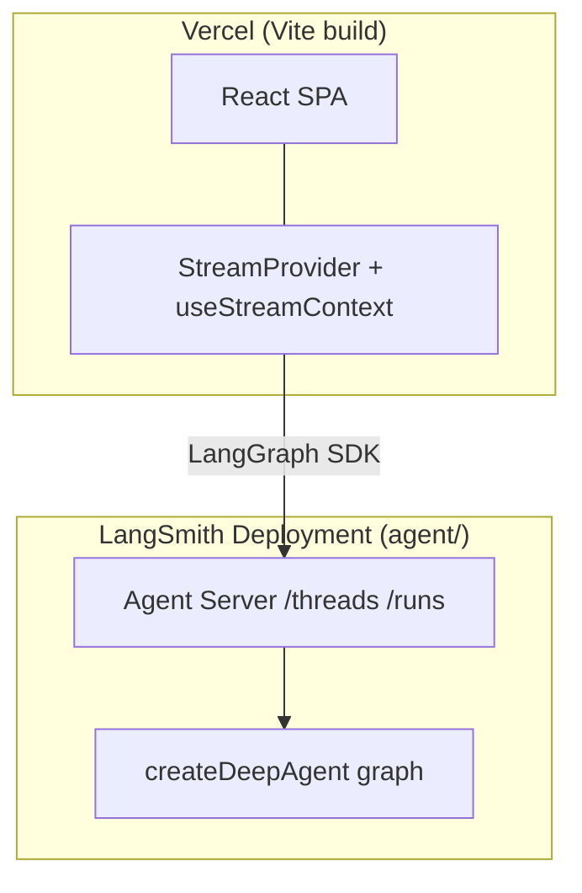

# Deploying a LangChain Agent with LangSmith + Vite

A self-contained Vite + React chat demo with a LangChain **deep agent** backend deployed to [LangSmith Deployment](https://docs.langchain.com/langsmith/deployment). The agent graph lives in `agent/` and is served by the LangGraph Agent Server; the UI in `src/` provides streaming chat, thread history, and subagent/tool-call rendering.

One package — `pnpm install`, `pnpm dev` starts LangGraph and Vite together.

The frontend talks to LangSmith's built-in [Agent Server](https://docs.langchain.com/langsmith/agent-server) API (`/threads`, `/runs`, …) through `@langchain/react`'s `StreamProvider` and the LangGraph SDK.

## Architecture



| Piece | Location | Deploy target |
| ----- | -------- | ------------- |
| Deep agent graph | `agent/` | LangSmith (`pnpm deploy`) |
| Chat UI | `src/` | Vercel (`pnpm build` → `dist/`) |

## Deploy the agent to LangSmith

```bash
cd js-langsmith
cp .env.example .env   # set OPENAI_API_KEY and LANGSMITH_API_KEY
pnpm install
pnpm deploy
```

This runs [`langgraphjs deploy`](https://docs.langchain.com/langsmith/cli#deploy). Set `LANGSMITH_DEPLOYMENT_NAME` in `.env` to control the deployment name (defaults to the directory name).

Copy the deployment **API URL** from the LangSmith UI (e.g. `https://your-app.us.langgraph.app`).

LangSmith Deployment provides durable checkpoint storage in production. The in-memory `MemorySaver` in `agent/index.ts` is only used for local `langgraph dev`.

## Deploy the frontend to Vercel

[](https://vercel.com/new/clone?repository-url=https%3A%2F%2Fgithub.com%2Flangchain-ai%2Fdeployment-cookbook&root-directory=js-langsmith&env=VITE_AGENT_API_URL,VITE_LANGSMITH_API_KEY&envDescription=LangSmith%20deployment%20URL%20and%20API%20key)

1. Connect the repo in Vercel with **Root Directory** `js-langsmith`.
2. Vercel auto-detects Vite — build output is `dist/`.
3. Set environment variables:
   - `VITE_AGENT_API_URL` — LangSmith deployment root URL, e.g. `https://your-app.us.langgraph.app`
   - `VITE_LANGSMITH_API_KEY` — LangSmith API key

## CI/CD

The agent deploys via GitHub Actions on pushes to `js-langsmith/agent/` (and root config files):

| Workflow | Triggers on | Action |
| -------- | ----------- | ------ |
| [`.github/workflows/deploy-langsmith-agent.yml`](../.github/workflows/deploy-langsmith-agent.yml) | Agent + root config changes | `langgraphjs deploy` to LangSmith |

| Name | Description |
| ---- | ----------- |
| `LANGSMITH_API_KEY` | LangSmith API key with deployment access |
| `LANGSMITH_DEPLOYMENT_NAME` (optional variable) | Deployment name override |

The frontend deploys through Vercel's Git integration.

## Agent Server API

| SDK call | Purpose |
| -------- | ------- |
| `client.threads.search()` | Thread sidebar |
| `client.threads.create()` / `delete()` | New / delete conversation |
| `StreamProvider` + `assistantId: "agent"` | Streaming chat, subagents, tool calls |

See the [Agent Server API reference](https://docs.langchain.com/langsmith/server-api-ref).

## Local development

```bash
cd js-langsmith
cp .env.example .env   # OPENAI_API_KEY (+ LANGSMITH_API_KEY for deploy)
pnpm install
pnpm dev
```

`pnpm dev` starts both:

- **LangGraph dev server** on [http://localhost:2024](http://localhost:2024)
- **Vite** on [http://localhost:5173](http://localhost:5173)

Open the Vite URL for the UI. Leave `VITE_AGENT_API_URL` unset — the client uses the Vite dev proxy at `/api/langgraph` (forwards to LangGraph on port 2024, avoiding CORS).

Individual processes:

```bash
pnpm dev:agent   # LangGraph only
pnpm dev:web     # Vite only
```

To test against a remote LangSmith deployment, add to `.env`:

```bash
VITE_AGENT_API_URL=https://your-app.us.langgraph.app
VITE_LANGSMITH_API_KEY=lsv2-...
```

## Project layout

```
js-langsmith/
├── package.json
├── langgraph.json
├── vite.config.ts
├── index.html
├── tsconfig.json          # project references
├── tsconfig.app.json      # src/ (React)
├── tsconfig.node.json     # vite.config.ts + agent/
├── agent/                 # deep agent graph (LangSmith backend)
├── src/                   # Vite + React SPA
└── .env.example
```

## References

- [LangSmith Deployment](https://docs.langchain.com/langsmith/deployment)
- [LangGraph CLI](https://docs.langchain.com/langsmith/cli)
- [Deep Agents going to production](https://docs.langchain.com/oss/javascript/deepagents/going-to-production)
- [Agent Server API reference](https://docs.langchain.com/langsmith/server-api-ref)
